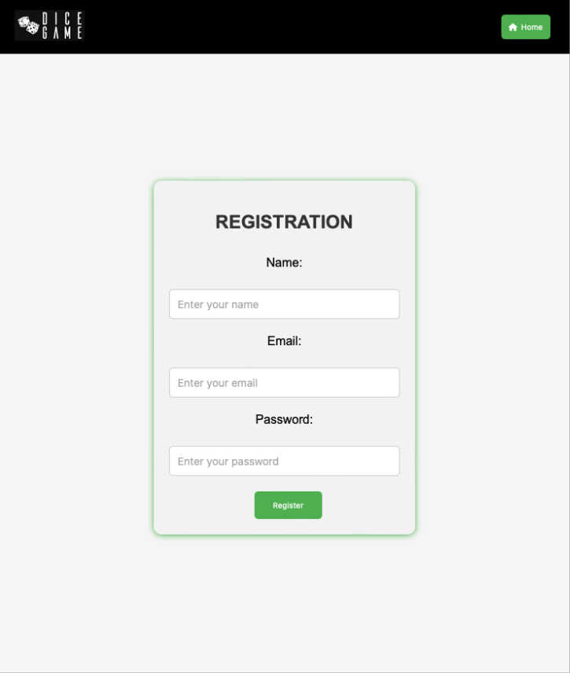
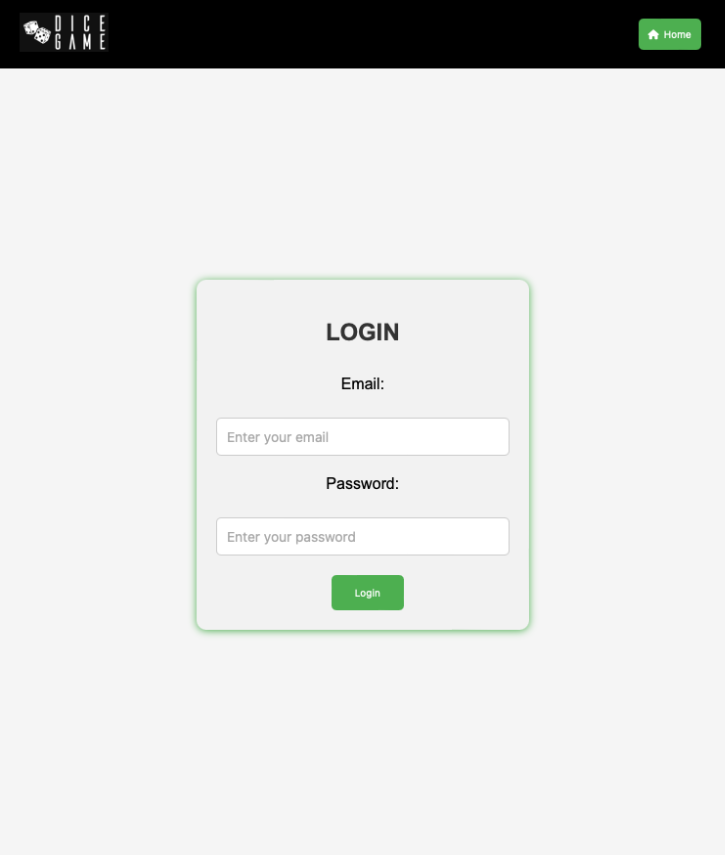
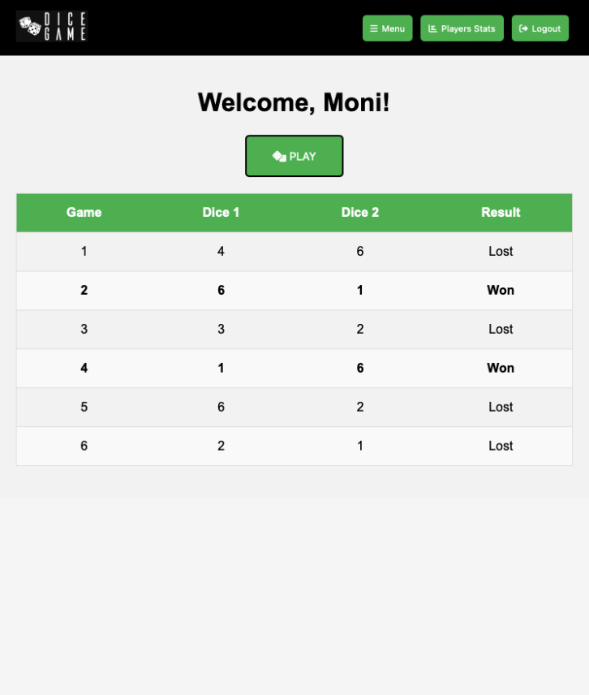
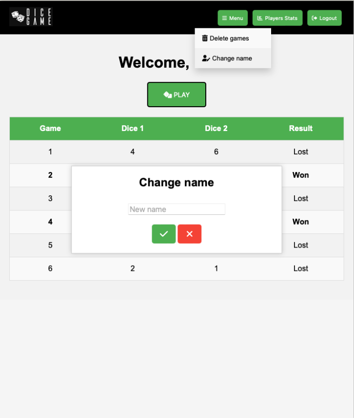
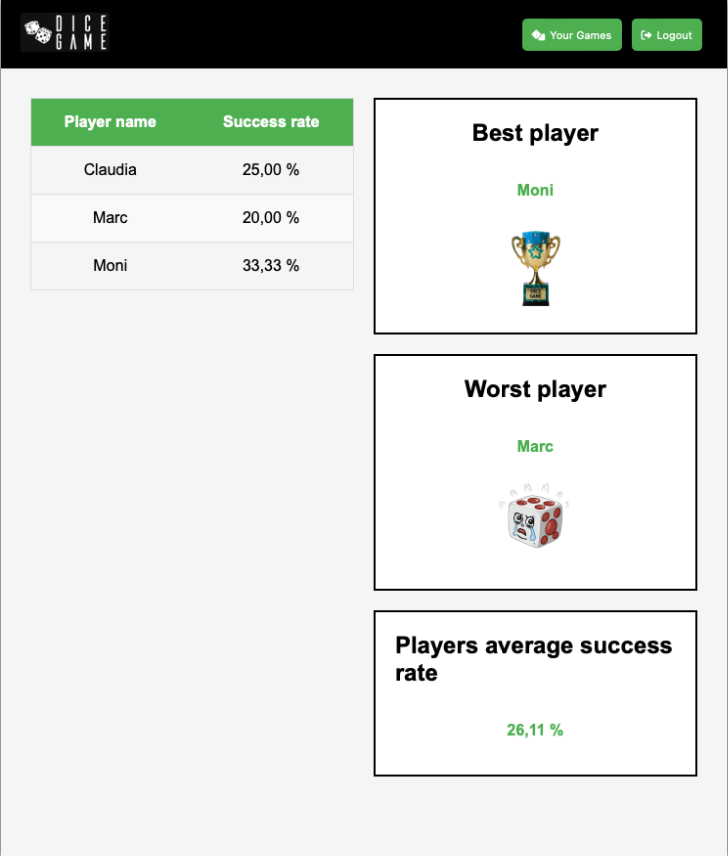

# 🎲 DICE GAME 🎲

## Despliegue de Spring Boot + MySQL en AWS con EC2 y RDS

Este repositorio contiene un proyecto desarrollado con Spring Boot que utiliza una arquitectura hexagonal y Thymeleaf para la capa de presentación. Además, se implementa una base de datos MySQL con Amazon RDS y la aplicación se despliega en una instancia de EC2 en AWS. Se ha incorporado un sistema de autenticación basado en JSON Web Tokens (JWT) para gestionar la seguridad y la identidad de los usuarios.

## Juego de dados con registro de jugadores

Este proyecto implementa un juego de dados en el que se lanzan dos dados, y la partida se gana si la suma de los resultados es 7. Cada jugador puede ver un historial de sus tiradas, incluyendo el valor de cada dado y si ganaron o perdieron. Además, se proporciona un porcentaje de éxito para cada jugador basado en sus tiradas.

### Características principales

- **Registro de Jugadores:**

    - Los usuarios deben registrarse con un nombre único. Se asigna a cada jugador un identificador numérico único y una fecha de registro.
    
    - Opcionalmente, los jugadores pueden registrarse de manera anónima sin proporcionar un nombre.

        

- **Iniciar sesión:**

    - Una vez registrado, introdce tu correo electrónico y contraseña en los campos correspondientes.

        

- **Historial de Tiradas:**

    - Cada jugador puede visualizar un historial de todas sus tiradas, con detalles como el valor de cada dado y el resultado de la partida (ganada o perdida).

        

- **Gestión de Datos:**

    - No es posible eliminar tiradas individuales, pero se puede borrar todo el historial de tiradas de un jugador.

    - Se puede modificar el nombre registrado.

        

 - **Comparar resultados:**   
    
    - Se proporciona una interfaz para listar todos los jugadores, con sus respectivos porcentajes de éxito y el porcentaje de éxito promedio del sistema. También se muestra al mejor y al peor jugador entre todos los que han jugado.

        

